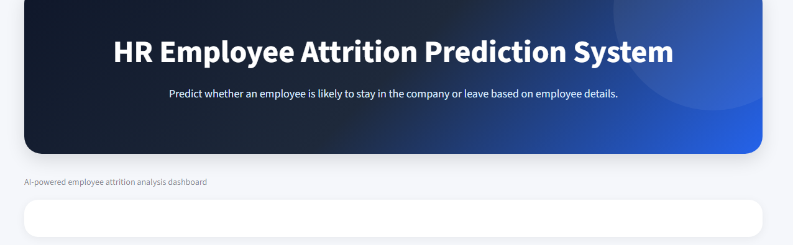
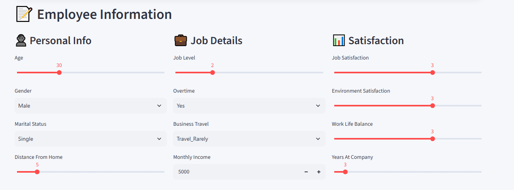
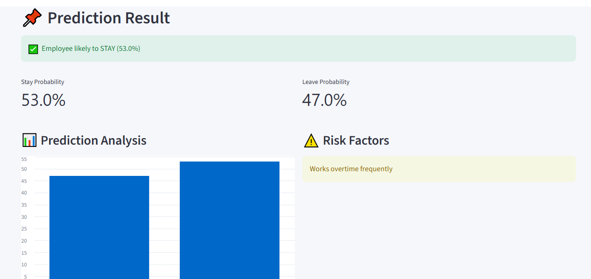

# Employee Attrition Prediction System

An interactive machine learning dashboard built with Streamlit that predicts whether an employee is likely to stay with a company or leave based on selected employee and workplace attributes.

## Overview

Employee attrition can have a significant impact on organizations through increased recruitment costs, productivity loss, and employee replacement efforts.

This project uses machine learning to analyze employee-related factors and estimate the probability of employee attrition.

The application provides an interactive dashboard where users can enter employee information and receive:

- Employee attrition prediction
- Stay probability
- Leave probability
- Prediction analysis chart
- Potential employee risk factors

## Features

- Interactive Streamlit dashboard
- Employee attrition prediction
- Random Forest classification model
- SMOTE for handling class imbalance
- Numerical feature scaling
- Categorical feature encoding
- Stay and leave probability estimates
- Risk-factor analysis
- Responsive dashboard interface
- Clean and user-friendly UI

  ## Screenshots

### Dashboard



### Employee Information



### Prediction Result



GitHub: https://github.com/bhu1ingeniator

## Machine Learning Workflow

The application follows this workflow:

```text
Employee Dataset
       ↓
Feature Selection
       ↓
Train/Test Split
       ↓
Data Preprocessing
       ├── Numerical Features → StandardScaler
       └── Categorical Features → OneHotEncoder
       ↓
SMOTE
       ↓
Random Forest Classifier
       ↓
Employee Input
       ↓
Prediction
       ↓
Stay / Leave Probability


